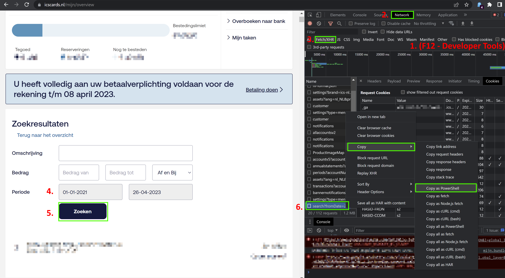
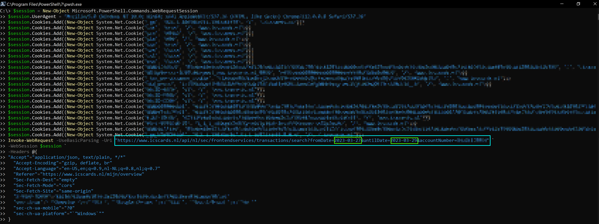
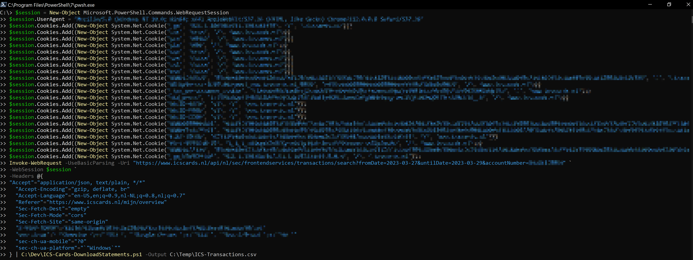
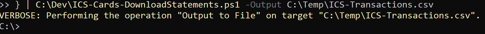
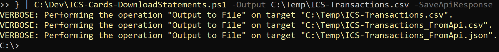
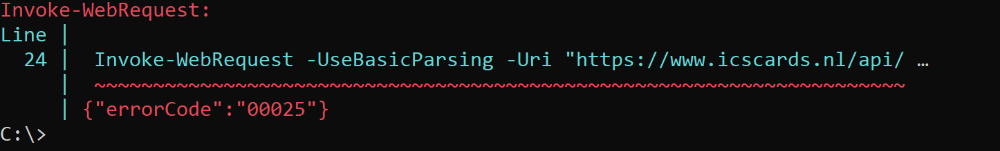

# ICS-Cards Statement downloader

These instructions allow you to download and export all your transactions directly from the API, using your authenticated session at https://www.icscards.nl.

This script leverages the capability in **Chrome** _**Developer Tools**_
to copy an authenticated request, which was used to populate transactions in your ICS-Cards search results for example. This request can be copied / replayed in several different scripting languages.

This script parses and exports this data to `.csv` format. It also optionally can save the raw results of the API in `.csv` and `.json` format. 

## Requirements

- Chrome (or Chromium browser)
- Powershell Core 7.0

## Usage

Open Chrome:

- Press F12 -> In 'Developer Tools' Make sure the 'Network' tab is selected.
- Navigate to https://www.icscards.nl and Login.
- Mijn ICS -> Overzicht -> 'Uitgebreid zoeken'
   * Enter your search criteria
   * Click 'Zoeken'

- In the 'Network' tab, the last added entry is 'search?....'
- Right-click entry -> Copy -> Copy as PowerShell



Open Powershell

- (WIN + R) -> 'pwsh'
- Paste the request:



Now we have an authenticated request.   
Note that you can update the search criteria if you want to do so.

Next step is to pipe the response of this authenticated request to our powershell script.   
Paste the following code directly after the request. Update the path to the script accordingly.

```
| C:\Dev\ICS-Cards-DownloadStatements.ps1 -Output C:\Temp\ICS-Transactions.csv
```



The script will respond with a confirmation that the .csv file has been created. 




## Tailoring data from API.

You can optionally choose to save the raw response from the api.    
The raw data will be saved in `.csv` and `.json` format.



The `.csv` can be imported in Excel to tailor the data, or you can modify the script to get the data in the format you prefer.    
If you want to modify the script and replay the data from an earlier request. 

```Powershell
C:\dev\ICS-Cards-DownloadStatements.ps1 -TransactionsFromApi (Get-Content C:\Temp\ICS-Transactions_FromApi.json -Raw | ConvertFrom-Json -Depth 100) -Output C:\Temp\ICS-Transactions.csv
```

## Known Issues

The authenticated session in the ICS-Cards website will expire after about less than a minute of inactivity.



If you get this error. Try logging in again, and complete all steps in under a minute.    
Alternatively, you can keep clicking and navigating the website to keep the session alive for longer while following the instructions.


